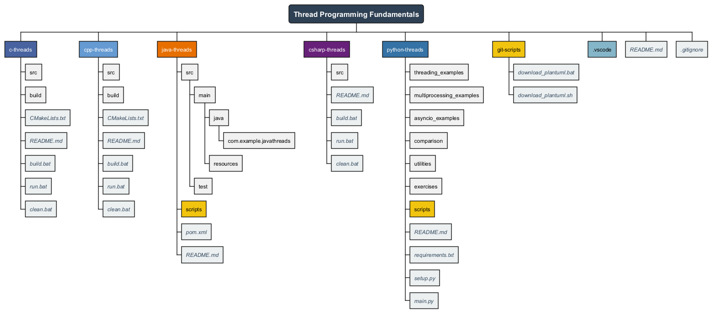
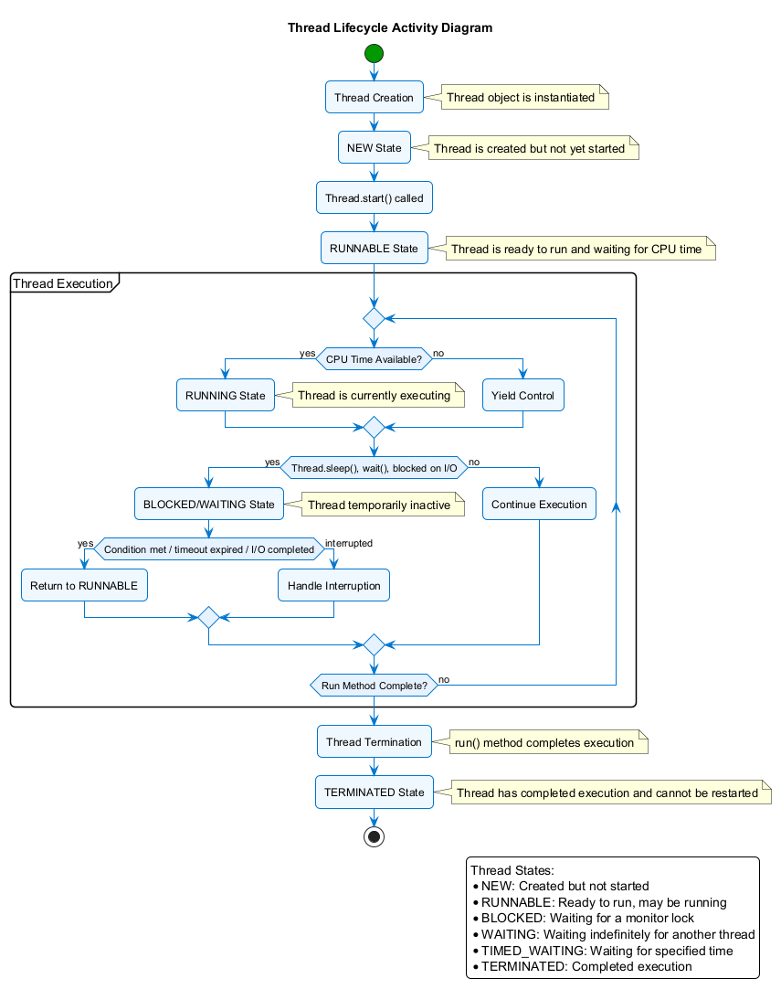
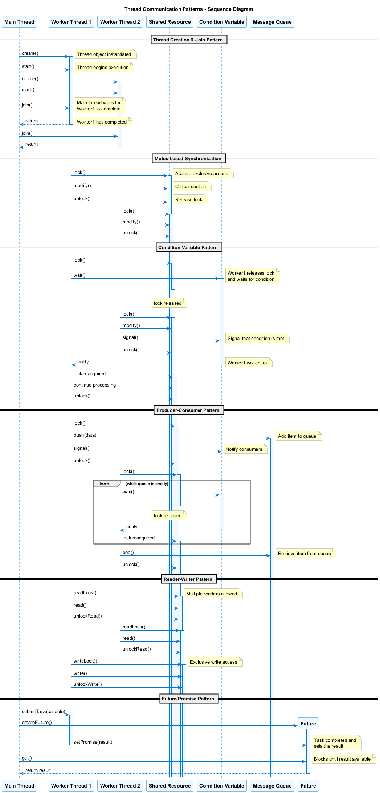
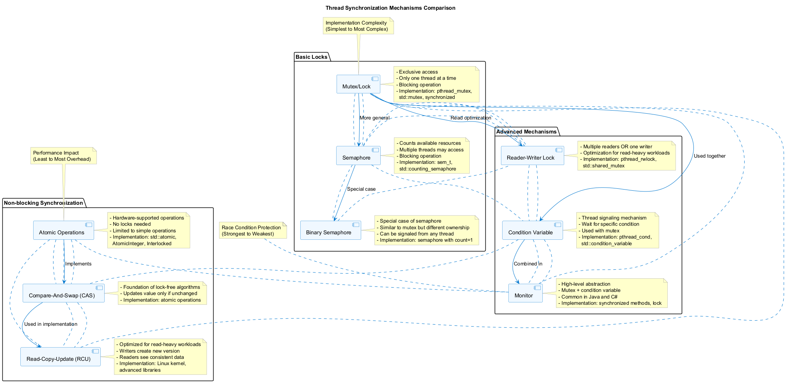
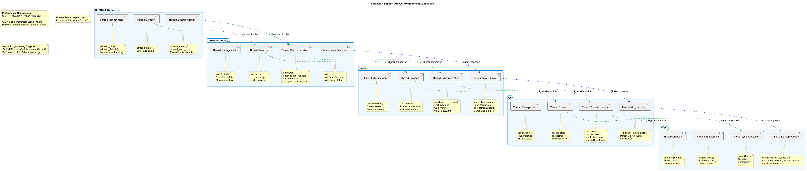
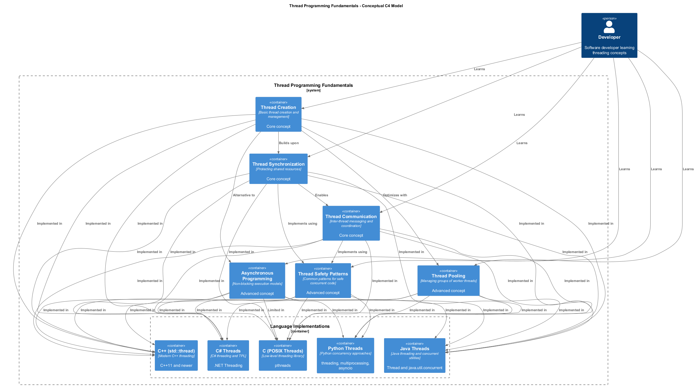
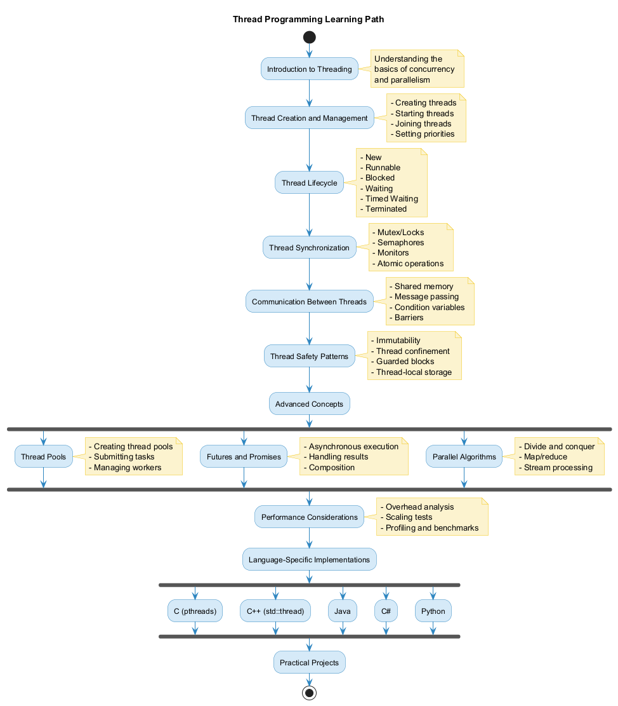

# 🧵 Thread Programming Fundamentals

A comprehensive educational repository containing thread programming examples and tutorials in multiple programming languages.

## 📋 Table of Contents

1. [Introduction](#introduction)
2. [Languages and Technologies](#languages-and-technologies)
3. [Repository Structure](#repository-structure)
4. [Visual Thread Models](#visual-thread-models)
5. [Learning Path](#learning-path)
6. [Getting Started](#getting-started)
7. [Common Threading Concepts](#common-threading-concepts)
8. [Prerequisites](#prerequisites)
9. [Contributing](#contributing)
10. [License](#license)

## 🚀 Introduction

This repository serves as a comprehensive resource for learning thread programming across multiple languages. Whether you are a beginner trying to understand the basics of concurrency or an experienced developer looking to deepen your knowledge, this repository provides structured examples and educational content to help you master threading concepts.

## 💻 Languages and Technologies

The repository includes threading examples in the following languages:

| Language | Threading Technologies | Directory |
|----------|------------------------|-----------|
| C | POSIX Threads (pthreads) | [c-threads/](c-threads/) |
| C++ | Modern C++ Threading (std::thread) | [cpp-threads/](cpp-threads/) |
| Java | Thread API and java.util.concurrent | [java-threads/](java-threads/) |
| C# | .NET Threading and Task Parallel Library (TPL) | [csharp-threads/](csharp-threads/) |
| Python | threading, multiprocessing, and asyncio | [python-threads/](python-threads/) |

## 📂 Repository Structure

Each language has its own directory with complete examples, documentation, and exercises:

```
thread-programming-fundamentals/
├── c-threads/               # POSIX threads examples and tutorials
├── cpp-threads/             # Modern C++ threading tutorials
├── java-threads/            # Java threading and concurrent programming
├── csharp-threads/          # C# and .NET threading approaches
├── python-threads/          # Python threading, multiprocessing, and asyncio
├── git-scripts/             # Utility scripts for Git and other tools
└── .vscode/                 # VS Code configuration
```

Each language directory contains its own README with detailed instructions and explanations specific to that language.



## 📊 Visual Thread Models

This repository includes several PlantUML diagrams to help visualize threading concepts:

### Common Threading Concepts

- **Thread Lifecycle**: [assets/thread_lifecycle.puml](assets/thread_lifecycle.puml) - Illustrates the lifecycle of a thread from creation to termination



- **Thread Communication Patterns**: [assets/thread_communication.puml](assets/thread_communication.puml) - Shows common patterns for thread communication



- **Synchronization Mechanisms**: [assets/synchronization_mechanisms.puml](assets/synchronization_mechanisms.puml) - Compares different synchronization mechanisms



- **Language Comparison**: [assets/language_threading_comparison.puml](assets/language_threading_comparison.puml) - Compares threading models across different programming languages



- **Threading Concepts C4 Model**: [assets/threading_concepts_c4.puml](assets/threading_concepts_c4.puml) - C4 architectural model of threading concepts



- **Learning Path**: [assets/learning_path.puml](assets/learning_path.puml) - Suggested learning path for threading concepts



### Language-Specific Models

Each language directory contains its own specific threading model diagram. See the respective README files for details.

### Viewing and Generating Diagrams

To generate the PNG images from the PlantUML files, use the scripts provided in the `git-scripts` directory:

```bash
# Go to the git-scripts directory
cd git-scripts

# To generate all diagrams at once:
generate_all_diagrams.bat

# To fix theme issues in PlantUML files:
fix_plantuml_themes.bat

# To download PlantUML jar file (if not already present):
download_plantuml.bat

# To generate specific diagram types (PNG, SVG, PDF, LaTeX):
run_plantuml_png.bat
run_plantuml_svg.bat
run_plantuml_pdf.bat
run_plantuml_latex.bat
```

These scripts handle downloading PlantUML if needed, ensuring consistent themes, and generating all diagram files.

## 🛣️ Learning Path

For each language, the examples follow a progressive path:

1. **Basic Thread Creation**: Learning how to create and start threads
2. **Thread Lifecycle Management**: Understanding thread states and how to control them
3. **Thread Synchronization**: Using mutexes, semaphores, and other synchronization primitives
4. **Inter-Thread Communication**: Techniques for threads to communicate with each other
5. **Thread Safety Patterns**: Common patterns for ensuring thread-safe code
6. **Advanced Concepts**: Language-specific advanced threading features
7. **Performance Considerations**: Understanding efficiency and scalability concerns

## 🏁 Getting Started

To get started with a specific language's threading examples:

1. Navigate to the corresponding language directory
2. Read the README.md file in that directory for specific instructions
3. Follow the setup instructions to configure your environment
4. Run the example programs in the suggested order

For example, to start with Java threading:

```bash
cd java-threads
# Follow instructions in java-threads/README.md
```

## 🔄 Common Threading Concepts

While the implementation details vary between languages, these core threading concepts are demonstrated throughout:

| Concept | Description |
|---------|-------------|
| Thread Creation | Starting new threads of execution |
| Thread Lifecycle | Understanding how threads start, run, and terminate |
| Synchronization | Protecting shared resources from concurrent access |
| Mutex/Locks | Mutual exclusion mechanisms |
| Semaphores | Controlling access to limited resources |
| Condition Variables | Signaling between threads |
| Atomic Operations | Operations that execute without interruption |
| Thread-Local Storage | Thread-specific data storage |
| Thread Pools | Reusing threads to reduce creation overhead |
| Deadlock Prevention | Avoiding and detecting deadlocks |

## 🛠️ Prerequisites

General requirements for all languages:

- Basic understanding of programming concepts
- Familiarity with the language you want to explore
- Appropriate development environment for the language

Specific requirements for each language:

- **C**: GCC or Clang compiler, POSIX-compatible environment
- **C++**: C++17 compatible compiler (MSVC, GCC, Clang)
- **Java**: JDK 11 or later, Maven or Gradle
- **C#**: .NET 6 SDK or later, Visual Studio or VS Code
- **Python**: Python 3.8 or later, virtual environment tool

See each language's README for detailed setup instructions.

## 👥 Contributing

Contributions are welcome! If you'd like to contribute:

1. Fork the repository
2. Create a feature branch: `git checkout -b feature/your-feature-name`
3. Commit your changes: `git commit -m 'Add some feature'`
4. Push to the branch: `git push origin feature/your-feature-name`
5. Open a Pull Request

Please ensure your code follows the project's coding standards and includes appropriate documentation.

## 📄 License

This project is licensed under the MIT License - see the [LICENSE](LICENSE) file for details.
