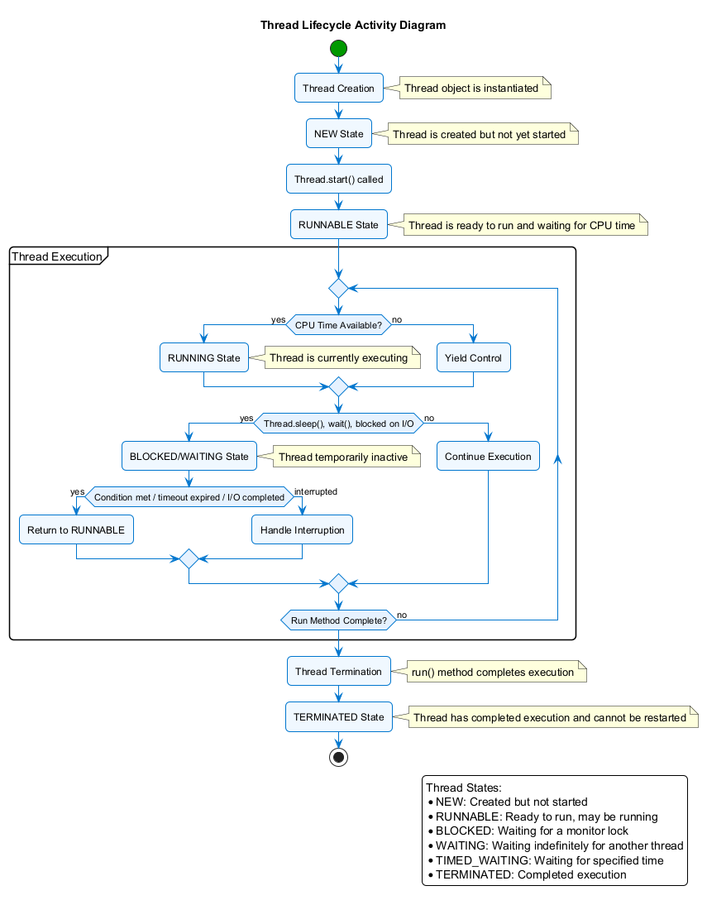

# C Threads Programming

This project demonstrates various threading concepts and patterns using Windows threads. It's a comprehensive tutorial and demonstration project showing how to use threads effectively in C programming on Windows.

## Prerequisites

- Windows 10 or later
- Visual Studio 2019 or 2022 with C/C++ workload installed
- CMake 3.15 or higher

## Thread Programming Visual Models

This project includes several PlantUML diagrams to help visualize threading concepts:

- **C POSIX Threading API Diagram**: Located at [assets/c_threading.puml](assets/c_threading.puml) - Shows the relationships between main POSIX threading types and functions


- **Thread Lifecycle**: Located at [../assets/thread_lifecycle.puml](../assets/thread_lifecycle.puml) - Illustrates the lifecycle of a thread from creation to termination



- **Thread Communication Patterns**: Located at [../assets/thread_communication.puml](../assets/thread_communication.puml) - Shows common patterns for thread communication


- **Synchronization Mechanisms**: Located at [../assets/synchronization_mechanisms.puml](../assets/synchronization_mechanisms.puml) - Compares different synchronization mechanisms


- **Language Comparison**: Located at [../assets/language_threading_comparison.puml](../assets/language_threading_comparison.puml) - Compares threading models across different programming languages


To generate PNG images from these PlantUML files, use the scripts provided in the `git-scripts` directory:

```bash
# Go to the git-scripts directory
cd ../git-scripts

# To generate all diagrams at once:
generate_all_diagrams.bat

# To generate only the C threading diagram:
java -jar plantuml.jar ../c-threads/assets/c_threading.puml
```

## Project Structure

- `src/` - Source code files
  - `main.c` - Main program that provides a menu to run all demos
  - `thread_basics.c` - Thread creation, joining, and detachment examples
  - `mutex_demo.c` - Mutex synchronization and race condition prevention
  - `condition_variables.c` - Thread signaling using condition variables
  - `producer_consumer.c` - Implementation of the producer-consumer pattern
  - `thread_specific_data.c` - Thread-local storage demonstration
  - `thread_cancellation.c` - Safe thread termination techniques
  - `thread_pool.c` - Basic thread pool implementation
- `build/` - Build output directory (created during build process)
- `bin/` - Binary output directory (created during build process)

## Building and Running

The project includes several batch files to simplify building and running:

### Quick Start

To clean, configure, build, and run all demos in sequence:

```
run_all.bat
```

### Step-by-Step

1. Clean the project (removes previous build artifacts):

```
clean.bat
```

2. Configure the project (generates Visual Studio project files):

```
configure.bat
```

3. Build the project:

```
build.bat
```

4. Run the demos:

```
run.bat
```

### Running Specific Demos

To run all demos in sequence without the interactive menu:

```
run.bat --run-all
```

## Threading Concepts Covered

### Basic Thread Operations
- Thread creation
- Thread joining
- Thread detachment

### Synchronization
- Mutex protection
- Race condition prevention
- Deadlock avoidance

### Communication Between Threads
- Condition variables
- Signaling mechanisms
- Producer-consumer pattern

### Thread-Specific Data
- Thread-local storage
- Per-thread state

### Thread Management
- Safe thread cancellation
- Thread pools
- Work queues

## Common Threading Pitfalls

### Race Conditions
Race conditions occur when multiple threads access shared data concurrently without proper synchronization. This can lead to unpredictable behavior.

### Deadlocks
Deadlocks occur when two or more threads are blocked forever, waiting for each other to release resources.

### Priority Inversion
Priority inversion happens when a high-priority thread is blocked, waiting for a resource held by a low-priority thread.

### Thread Safety
Code that can be safely executed by multiple threads simultaneously is considered thread-safe.

## Best Practices

1. **Minimize shared state**: The less data shared between threads, the fewer synchronization issues.
2. **Use proper synchronization**: Always use appropriate synchronization mechanisms for shared data.
3. **Avoid blocking the UI thread**: In GUI applications, keep the UI thread responsive.
4. **Be careful with thread termination**: Always terminate threads gracefully.
5. **Consider thread pool**: For many small tasks, a thread pool is more efficient than creating individual threads.
6. **Profile and benchmark**: Measure performance to ensure threading is beneficial.

## License

This project is provided as open-source software for educational purposes.
