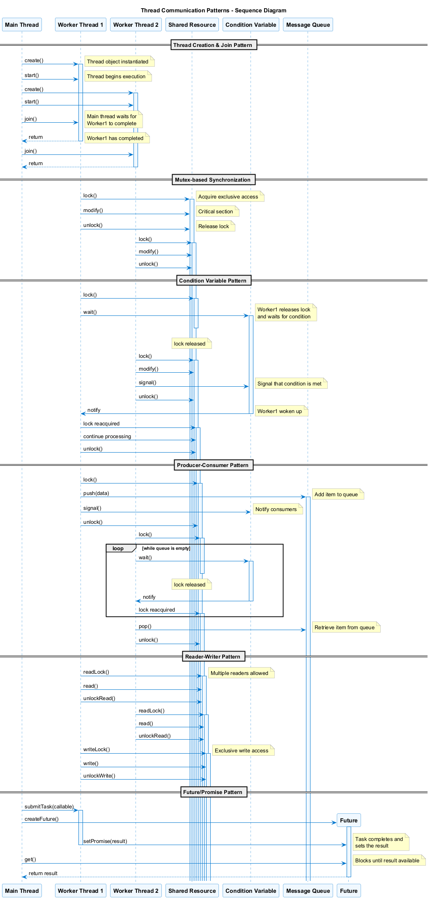
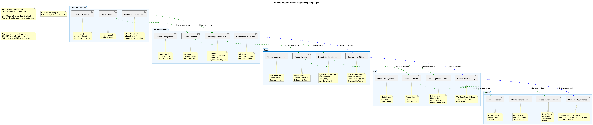

# 🧵 C++ Threading Programming Fundamentals

This project is a comprehensive educational material designed to teach you about thread programming and concurrency in C++. It covers various topics from basic thread creation to advanced concurrency patterns using the C++11 and newer threading facilities.

## 🎯 Purpose of This Project

With this project, you will learn:
- How to use C++11's `std::thread` library
- Thread synchronization with mutexes and condition variables
- Advanced synchronization primitives like reader-writer locks and barriers
- Atomic operations and lock-free programming
- Asynchronous programming with futures and promises

## 📊 Thread Programming Visual Models

This project includes several PlantUML diagrams to help visualize threading concepts:

- **C++ Thread API Class Diagram**: Located at [assets/cpp_threading.puml](assets/cpp_threading.puml) - Shows the relationships between main C++ threading classes and types


- **Thread Lifecycle**: Located at [../assets/thread_lifecycle.puml](../assets/thread_lifecycle.puml) - Illustrates the lifecycle of a thread from creation to termination


- **Thread Communication Patterns**: Located at [../assets/thread_communication.puml](../assets/thread_communication.puml) - Shows common patterns for thread communication



- **Synchronization Mechanisms**: Located at [../assets/synchronization_mechanisms.puml](../assets/synchronization_mechanisms.puml) - Compares different synchronization mechanisms


- **Language Comparison**: Located at [../assets/language_threading_comparison.puml](../assets/language_threading_comparison.puml) - Compares threading models across different programming languages



To generate PNG images from these PlantUML files, use the scripts provided in the `git-scripts` directory:

```bash
# Go to the git-scripts directory
cd ../git-scripts

# To generate all diagrams at once:
generate_all_diagrams.bat

# To generate only the C++ threading diagram:
java -jar plantuml.jar ../cpp-threads/assets/cpp_threading.puml
```

## 📋 Learning Roadmap

We recommend exploring this project in the following order:

1. **Basic Thread Concepts** - Understanding thread creation and management
2. **Thread Synchronization** - Mutexes, locks, and race condition prevention
3. **Advanced Synchronization** - Condition variables and their usage patterns
4. **Concurrent Data Structures** - Thread-safe container implementations
5. **Async Programming** - Future/Promise pattern and asynchronous tasks

## 🚀 Getting Started

### Requirements

- C++11 compliant compiler (gcc 4.8+, clang 3.3+, MSVC 2015+)
- CMake 3.10 or higher
- Your preferred C++ IDE (Visual Studio, CLion, VSCode, etc.)

### Building the Project

#### Using Command Scripts (Windows)

```bash
# Configure the project
configure.bat

# Build the project
build.bat

# Run all examples
run_all.bat

# Or run a specific example
run.bat <example_name>

# Clean the build files
clean.bat
```

#### Using CMake Manually

```bash
# Create a build directory
mkdir build
cd build

# Configure with CMake
cmake ..

# Build
cmake --build .

# Run
./bin/example_basic_thread
```

## 📘 Code Examples

### Basic Thread Example

```cpp
#include <iostream>
#include <thread>
#include <string>

void hello(const std::string& name) {
    std::cout << "Hello, " << name << " from thread " 
              << std::this_thread::get_id() << std::endl;
}

int main() {
    std::thread t(hello, "World");
    
    std::cout << "Main thread: " << std::this_thread::get_id() << std::endl;
    
    // Wait for the thread to finish
    t.join();
    
    return 0;
}
```

### Mutex Example

```cpp
#include <iostream>
#include <thread>
#include <mutex>
#include <vector>

std::mutex mtx;
int counter = 0;

void increment(int iterations) {
    for (int i = 0; i < iterations; ++i) {
        std::lock_guard<std::mutex> lock(mtx);
        ++counter;
    }
}

int main() {
    std::vector<std::thread> threads;
    
    for (int i = 0; i < 10; ++i) {
        threads.push_back(std::thread(increment, 1000));
    }
    
    for (auto& t : threads) {
        t.join();
    }
    
    std::cout << "Final counter value: " << counter << std::endl;
    return 0;
}
```

## 📝 Additional Resources

- [C++ Reference - Thread library](https://en.cppreference.com/w/cpp/thread)
- [C++11 Concurrency Tutorial](https://thispointer.com/c11-multithreading-part-1-introduction-to-thread/)
- [Anthony Williams - C++ Concurrency in Action](https://www.manning.com/books/c-plus-plus-concurrency-in-action-second-edition)

## 🤝 Contributing

Contributions are welcome! Please feel free to submit a Pull Request to improve examples or fix any issues.

## 📜 License

This project is licensed under the MIT License - see the LICENSE file for details. 