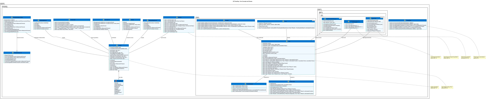

# C# Threading Programming Fundamentals

This project is a console application that demonstrates the fundamental concepts of thread programming in C#.

## Running Guide

This project uses .NET 6.0 SDK. You need to have .NET 6.0 SDK installed to run the project.

## Thread Programming Visual Models

This project includes several PlantUML diagrams to help visualize threading concepts:

- **C# Threading API Diagram**: Located at [assets/csharp_threading.puml](assets/csharp_threading.puml) - Shows the relationships between main C# threading classes and types



- **Thread Lifecycle**: Located at [../assets/thread_lifecycle.puml](../assets/thread_lifecycle.puml) - Illustrates the lifecycle of a thread from creation to termination


- **Thread Communication Patterns**: Located at [../assets/thread_communication.puml](../assets/thread_communication.puml) - Shows common patterns for thread communication


- **Synchronization Mechanisms**: Located at [../assets/synchronization_mechanisms.puml](../assets/synchronization_mechanisms.puml) - Compares different synchronization mechanisms


- **Language Comparison**: Located at [../assets/language_threading_comparison.puml](../assets/language_threading_comparison.puml) - Compares threading models across different programming languages


To generate PNG images from these PlantUML files, use the scripts provided in the `git-scripts` directory:

```bash
# Go to the git-scripts directory
cd ../git-scripts

# To generate all diagrams at once:
generate_all_diagrams.bat

# To generate only the C# threading diagram:
java -jar plantuml.jar ../csharp-threads/assets/csharp_threading.puml
```

## Batch Scripts

The project includes the following batch scripts:

1. **clean.bat** - Cleans the project (deletes bin and obj folders)
2. **build.bat** - Builds the project
3. **run.bat** - Runs the project
4. **build-and-run.bat** - Builds and runs the project
5. **colored-build-and-run.bat** - Builds and runs the project with colored output

## Colored Output

For colored output in Windows Command Prompt, you need to enable ANSI color support. You can do this by running the `enable-ansi-colors.reg` file included in the project.

## Project Structure

The project demonstrates various threading concepts in C#:

1. **Basic Thread Creation** - Creating and starting threads
2. **Thread Pool** - Using the ThreadPool for efficient thread management
3. **Task Parallel Library (TPL)** - Using Task and Task<T> for asynchronous operations
4. **Async/Await** - Modern asynchronous programming pattern
5. **Thread Synchronization** - Using locks, monitors, and other synchronization primitives
6. **Concurrent Collections** - Thread-safe collection types

## Requirements

- .NET 6.0 SDK or newer
- Windows operating system (for batch scripts)
- Visual Studio 2022 or Visual Studio Code (recommended)

## Additional Resources

- [Microsoft Docs - Threading in C#](https://docs.microsoft.com/en-us/dotnet/standard/threading/)
- [Microsoft Docs - Task Parallel Library](https://docs.microsoft.com/en-us/dotnet/standard/parallel-programming/task-parallel-library-tpl)
- [Microsoft Docs - Async/Await Pattern](https://docs.microsoft.com/en-us/dotnet/csharp/programming-guide/concepts/async/)

## License

This project is licensed under the MIT License. 