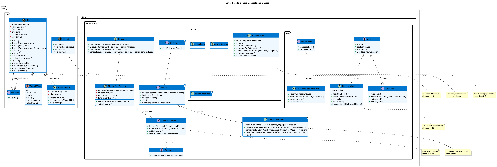

# 🧵 Java Threading Programming Fundamentals

This project is a comprehensive educational material designed to teach you about thread programming and concurrency in Java. It covers various topics from basic thread creation to advanced concurrency patterns.

## 🎯 Purpose of This Project

With this project, you will learn:
- How threads are created and managed
- Fundamental problems and solutions in concurrent programming
- Java's concurrency tools and their use cases
- Advantages and challenges of parallel programming

## 📊 Thread Programming Visual Models

This project includes several PlantUML diagrams to help visualize threading concepts:

- **Java Thread API Class Diagram**: Located at [assets/java_threading.puml](assets/java_threading.puml) - Shows the relationships between main Java threading classes and interfaces



- **Thread Lifecycle**: Located at [../assets/thread_lifecycle.puml](../assets/thread_lifecycle.puml) - Illustrates the lifecycle of a thread from creation to termination


- **Thread Communication Patterns**: Located at [../assets/thread_communication.puml](../assets/thread_communication.puml) - Shows common patterns for thread communication


- **Synchronization Mechanisms**: Located at [../assets/synchronization_mechanisms.puml](../assets/synchronization_mechanisms.puml) - Compares different synchronization mechanisms


To generate PNG images from these PlantUML files, use the scripts provided in the `git-scripts` directory:

```bash
# Go to the git-scripts directory
cd ../git-scripts

# To generate all diagrams at once:
generate_all_diagrams.bat

# To generate only the Java threading diagram:
java -jar plantuml.jar ../java-threads/assets/java_threading.puml
```

## 📋 Learning Roadmap

We recommend exploring this project in the following order:

1. **Basic Thread Concepts** (`Main.java` and `RunnableExample.java`)
2. **Synchronization and Thread Safety** (`SynchronizationExample.java`)
3. **Executor Framework and Thread Pools** (`ExecutorExample.java`)
4. **Writing Concurrent Tests** (`SynchronizationExampleTest.java`)

## 🚀 Getting Started

### Requirements

- Java JDK 11 or higher
- Maven 3.6.0 or higher
- Your preferred Java IDE (IntelliJ IDEA, Eclipse, VS Code, etc.)

### Running the Project

This project includes the following script files:

```
java-threads/scripts/
├── clean.bat       # Cleans the project (deletes the target folder)
├── build.bat       # Builds the project (without running tests)
├── test.bat        # Runs the tests
└── run.bat         # Runs the application
```

You can execute the following commands in the command prompt:

```bash
# To clean the project
cd java-threads/scripts
clean.bat

# To build the project
build.bat

# To run the tests
test.bat

# To run the application
run.bat

# To perform operations in sequence
clean.bat && build.bat && test.bat && run.bat
```

## 📂 Project Structure

```
java-threads/
├── pom.xml                                      # Maven configuration file
├── README.md                                    # This file
├── src/
│   ├── main/
│   │   ├── java/
│   │   │   └── com/
│   │   │       └── example/
│   │   │           └── javathreads/
│   │   │               ├── Main.java                 # Main entry point
│   │   │               ├── RunnableExample.java      # Runnable interface example
│   │   │               ├── SynchronizationExample.java # Synchronization example
│   │   │               └── ExecutorExample.java      # Executor framework example
│   │   └── resources/                          # Resource files
│   └── test/
│       └── java/
│           └── com/
│               └── example/
│                   └── javathreads/
│                       └── SynchronizationExampleTest.java  # Test examples
└── scripts/                                     # Script files
    ├── build.bat                               # Build command
    ├── clean.bat                               # Clean command
    ├── run.bat                                 # Run command
    └── test.bat                                # Test command
```

## 📚 Java Thread Model

### Thread Lifecycle
A thread goes through the following states:
1. **New**: Thread is created but not yet started
2. **Runnable**: Thread is ready to run, waiting for CPU time
3. **Blocked**: Thread is waiting for a monitor lock
4. **Waiting**: Thread is waiting for another thread to perform an action
5. **Timed Waiting**: Thread is waiting for a specific period
6. **Terminated**: Thread has completed execution

### Thread Creation Methods in Java

1. **Extending Thread Class**:
   ```java
   class MyThread extends Thread {
       public void run() {
           // Your thread code here
       }
   }
   MyThread t = new MyThread();
   t.start();
   ```

2. **Implementing Runnable Interface** (Preferred method):
   ```java
   class MyRunnable implements Runnable {
       public void run() {
           // Your thread code here
       }
   }
   Thread t = new Thread(new MyRunnable());
   t.start();
   ```

3. **Using Lambda Expressions**:
   ```java
   Thread t = new Thread(() -> {
       // Your thread code here
   });
   t.start();
   ```

## 🔒 Synchronization

One of the most important topics in concurrent programming is ensuring safe access to shared data by multiple threads.

### Basic Synchronization Mechanisms

1. **synchronized Keyword**:
   ```java
   // Method-level synchronization
   public synchronized void increment() {
       counter++;
   }
   
   // Block-level synchronization
   public void increment() {
       synchronized(this) {
           counter++;
       }
   }
   ```

2. **Lock Interface**:
   ```java
   private final Lock lock = new ReentrantLock();
   
   public void increment() {
       lock.lock();
       try {
           counter++;
       } finally {
           lock.unlock();
       }
   }
   ```

## 🧮 Executor Framework

Java's `java.util.concurrent` package provides a higher-level API for creating and managing threads.

### Basic Usage Examples

1. **Creating a Thread Pool**:
   ```java
   ExecutorService executor = Executors.newFixedThreadPool(5);
   ```

2. **Submitting Tasks**:
   ```java
   executor.submit(() -> {
       System.out.println("Task executed by " + Thread.currentThread().getName());
   });
   ```

3. **Shutdown**:
   ```java
   executor.shutdown();
   ```

## 🧪 Student Exercises

1. **Thread Creation**: Create two different threads and assign different tasks to them.
2. **Synchronization**: Create threads that increment a shared counter and solve the race condition problem.
3. **Thread Pool**: Use ExecutorService to parallelize a file reading operation.
4. **Deadlock**: Create and solve a deadlock situation where two threads are waiting for each other.

## 📌 Concurrent Programming Tips

1. **Minimize Shared Mutable State**: Minimize shared state variables to reduce synchronization issues.
2. **Prefer Immutability**: Immutable objects are inherently thread-safe.
3. **Use Higher-Level Concurrency Tools**: Prefer Executors, concurrent collections, and atomic variables over raw threads and synchronization.
4. **Proper Resource Management**: Always clean up resources (e.g., shutting down ExecutorServices).
5. **Acquire Locks in a Consistent Order**: Always acquire locks in the same order to prevent deadlocks.

## 🔍 Common Concurrency Issues

1. **Race Condition**: When behavior depends on the relative timing of events.
2. **Deadlock**: When two or more threads are waiting for each other to release locks.
3. **Livelock**: When threads keep changing their state in response to each other without making progress.
4. **Thread Starvation**: When a thread is unable to gain regular access to shared resources.

## 📖 Resources and Further Reading

1. [Java Concurrency in Practice](https://jcip.net/) - Brian Goetz
2. [Oracle's Java Tutorials: Concurrency](https://docs.oracle.com/javase/tutorial/essential/concurrency/)
3. [Java 8 Concurrency Tutorial](https://winterbe.com/posts/2015/04/07/java8-concurrency-tutorial-thread-executor-examples/) 