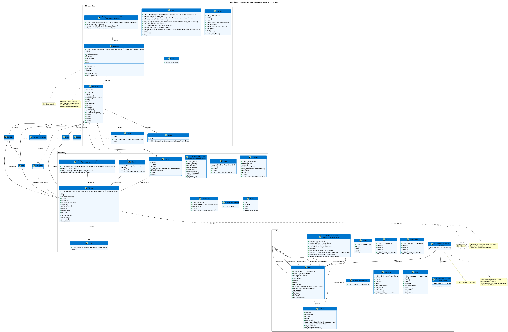

# 🧵 Python Threading and Concurrency Tutorial

This project provides a comprehensive tutorial on threading and concurrency in Python, covering everything from basic thread creation to advanced asynchronous programming patterns.

## 📋 Table of Contents

1. [Introduction](#introduction)
2. [Project Structure](#project-structure)
3. [Setup and Installation](#setup-and-installation)
   - [Using Batch Scripts (Recommended for Windows)](#using-batch-scripts-recommended-for-windows)
   - [Using Virtual Environment Manually](#using-virtual-environment-manually)
   - [Using Conda](#using-conda)
   - [Using Docker](#using-docker)
4. [Running the Examples](#running-the-examples)
5. [Key Project Files](#key-project-files)
6. [Python Concurrency Models](#python-concurrency-models)
7. [Performance Considerations](#performance-considerations)
8. [Best Practices](#best-practices)
9. [Contributing](#contributing)
10. [License](#license)

## 🚀 Introduction

This project demonstrates different approaches to concurrency in Python:

1. **Threading (threading module)**: Suitable for I/O-bound tasks where operations spend time waiting for external resources.
2. **Multiprocessing (multiprocessing module)**: Ideal for CPU-bound tasks, bypassing the GIL to achieve true parallelism.
3. **Asynchronous I/O (asyncio)**: Perfect for I/O-bound tasks with high concurrency needs, using a single-threaded event loop.
4. **Concurrent.futures**: High-level abstractions for both threading and multiprocessing.

## 📂 Project Structure

```
python-threads/
├── scripts/                       # Batch scripts for easy usage
│   ├── README.md                  # Script documentation
│   ├── clean.bat                  # Cleans the project
│   ├── setup.bat                  # Sets up the environment
│   ├── install.bat                # Installs the project
│   ├── run.bat                    # Runs the application
│   ├── test.bat                   # Runs tests
│   └── all.bat                    # Does all steps in sequence
├── threading_examples/            # Threading module examples
│   ├── basic_threads.py           # Thread creation and management
│   ├── synchronization.py         # Locks and other primitives
│   ├── communication.py           # Inter-thread communication
│   └── producer_consumer.py       # Queue-based communication
├── multiprocessing_examples/      # Multiprocessing module examples
│   ├── basic_processes.py         # Process creation and management
│   ├── shared_memory.py           # Shared memory between processes
│   └── process_pools.py           # Process pools for parallel execution
├── asyncio_examples/              # Asyncio examples
│   ├── basic_asyncio.py           # Coroutines and event loops
│   ├── async_io_operations.py     # Asynchronous I/O operations
│   └── async_web_requests.py      # Async HTTP requests
├── comparison/                    # Performance comparisons
│   ├── io_bound_comparison.py     # I/O-bound task comparison
│   └── cpu_bound_comparison.py    # CPU-bound task comparison
├── utilities/                     # Common utilities
│   ├── timing.py                  # Timing utilities
│   └── visualization.py           # Result visualization
├── exercises/                     # Practice exercises
│   ├── web_scraping.py            # Concurrent web scraping
│   ├── data_processing.py         # Parallel data processing
│   └── thread_safe_structures.py  # Custom thread-safe data structures
├── environment.yml                # Conda environment specification
├── requirements.txt               # Python dependencies
├── setup.py                       # Package installation configuration
├── Dockerfile                     # Docker configuration
└── main.py                        # Main application entry point
```

## 🛠 Setup and Installation

### Using Batch Scripts (Recommended for Windows)

We've created several batch scripts to simplify working with this project:

#### First-Time Setup

```bash
# Navigate to the scripts directory
cd python-threads/scripts

# Set up the virtual environment and install dependencies
setup.bat

# Install the project in development mode
install.bat
```

#### Regular Usage

```bash
# Navigate to the scripts directory
cd python-threads/scripts

# Just run the application
run.bat
```

#### Complete Reset and Run

```bash
# Navigate to the scripts directory
cd python-threads/scripts

# Clean, setup, install, test, and run in one step
all.bat
```

#### Individual Scripts

- **clean.bat**: Removes virtual environment and cache files
- **setup.bat**: Creates virtual environment and installs dependencies
- **install.bat**: Installs the project in development mode
- **run.bat**: Runs the main application
- **test.bat**: Runs tests
- **all.bat**: Executes all steps in sequence

### Using Virtual Environment Manually

```bash
# Create a virtual environment
python -m venv venv

# Activate the virtual environment
# On Windows:
venv\Scripts\activate
# On Unix/MacOS:
source venv/bin/activate

# Install dependencies
pip install -r requirements.txt

# Install project in development mode
pip install -e .

# Run the application
python main.py
```

### Using Conda

```bash
# Create and activate the conda environment
conda env create -f environment.yml
conda activate python-threading

# Run the application
python main.py
```

### Using Docker

```bash
# Build the Docker image
docker build -t python-threading .

# Run the container
docker run -it python-threading
```

## 🏃‍♂️ Running the Examples

### Using the Main Application

The easiest way to explore the examples is through the main application:

```bash
# Using scripts (Windows)
cd python-threads/scripts
run.bat

# Or directly
python main.py
```

This will launch an interactive menu where you can choose different examples to run.

### Running Individual Examples

Each example can be run as a standalone Python script:

```bash
# Run a threading example
python -m threading_examples.basic_threads

# Run a multiprocessing example
python -m multiprocessing_examples.basic_processes

# Run an asyncio example
python -m asyncio_examples.basic_asyncio

# Run a comparison
python -m comparison.io_bound_comparison
```

## 📑 Key Project Files

### requirements.txt

This file lists all the Python package dependencies required for the project.

**Usage:**
```bash
# Install all dependencies
pip install -r requirements.txt
```

### setup.py

This file allows you to install the project as a Python package.

**Usage:**
```bash
# Install in development mode (changes to code take effect immediately)
pip install -e .

# Regular installation
pip install .

# Create distribution packages
python setup.py sdist bdist_wheel
```

### Dockerfile

This file contains instructions to build a Docker container for the project.

**Usage:**
```bash
# Build the Docker image
docker build -t python-threading .

# Run the container
docker run -it python-threading
```

## 🧠 Python Concurrency Models

### The Global Interpreter Lock (GIL)

The GIL is a mutex that protects access to Python objects, preventing multiple threads from executing Python bytecode simultaneously. Key implications:

- Only one thread can execute Python code at a time
- Threading in Python doesn't provide true parallelism for CPU-bound tasks
- I/O operations release the GIL, allowing other threads to run
- CPU-bound tasks should use multiprocessing to bypass the GIL

### When to Use Each Approach

- **Threading**: 
  - I/O-bound tasks (network requests, file operations)
  - When shared memory is needed
  - Simple concurrency with limited CPU operations

- **Multiprocessing**:
  - CPU-bound tasks (calculations, data processing)
  - When true parallelism is required
  - When isolation between processes is beneficial

- **Asyncio**:
  - High-concurrency I/O operations
  - When cooperative multitasking is sufficient
  - Event-driven applications

- **Concurrent.futures**:
  - When you need a simple, high-level interface
  - When you want to easily switch between threads and processes

## 📊 Performance Considerations

- Thread creation has overhead - use pools for many small tasks
- Process creation has even more overhead than thread creation
- The GIL makes threading ineffective for CPU-bound tasks
- Excessive synchronization can negate concurrency benefits
- I/O-bound tasks benefit most from threading and asyncio
- CPU-bound tasks benefit most from multiprocessing
- The comparison module includes benchmarks to demonstrate these differences

## ✅ Best Practices

1. **Understand the GIL**: Know its limitations for CPU-bound tasks
2. **Choose the right tool**: Threading for I/O, multiprocessing for CPU, asyncio for high-concurrency I/O
3. **Minimize shared state**: Use message passing when possible
4. **Use high-level abstractions**: concurrent.futures, asyncio, and multiprocessing pools
5. **Proper resource management**: Use context managers and proper cleanup
6. **Avoid race conditions**: Use proper synchronization primitives
7. **Consider thread/process pools**: Reuse workers instead of creating new ones
8. **Beware of deadlocks**: Acquire locks in a consistent order
9. **Profile before optimizing**: Ensure concurrency actually improves performance

## 🤝 Contributing

Contributions are welcome! Please feel free to submit a Pull Request.

## 📝 License

This project is open source and available under the [MIT License](LICENSE).

## 🐍 Python Threading Examples

This repository contains examples and tutorials for Python's concurrency models: threading, multiprocessing, and asyncio.

## 📋 Table of Contents

- [Introduction](#introduction)
- [Project Structure](#project-structure)
- [Thread Programming Visual Models](#thread-programming-visual-models)
- [Setup and Installation](#setup-and-installation)
- [Running Examples](#running-examples)
- [Key Project Files](#key-project-files)
- [Python Concurrency Models](#python-concurrency-models)
- [Performance Considerations](#performance-considerations)
- [Best Practices](#best-practices)
- [Contributing](#contributing)
- [License](#license)

## 🚀 Introduction

Python offers multiple approaches to concurrent programming, each with its own strengths and use cases. This repository provides practical examples and explanations for:

- **Threading**: Lightweight concurrent execution within a single process
- **Multiprocessing**: Parallel execution across multiple CPU cores
- **Asyncio**: Cooperative multitasking with coroutines

## 🗂️ Project Structure

The project is organized into the following directories:

```
python-threads/
├── scripts/                       # Batch scripts for easy usage
│   ├── README.md                  # Script documentation
│   ├── clean.bat                  # Cleans the project
│   ├── setup.bat                  # Sets up the environment
│   ├── install.bat                # Installs the project
│   ├── run.bat                    # Runs the application
│   ├── test.bat                   # Runs tests
│   └── all.bat                    # Does all steps in sequence
├── threading_examples/            # Threading module examples
│   ├── basic_threads.py           # Thread creation and management
│   ├── synchronization.py         # Locks and other primitives
│   ├── communication.py           # Inter-thread communication
│   └── producer_consumer.py       # Queue-based communication
├── multiprocessing_examples/      # Multiprocessing module examples
│   ├── basic_processes.py         # Process creation and management
│   ├── shared_memory.py           # Shared memory between processes
│   └── process_pools.py           # Process pools for parallel execution
├── asyncio_examples/              # Asyncio examples
│   ├── basic_asyncio.py           # Coroutines and event loops
│   ├── async_io_operations.py     # Asynchronous I/O operations
│   └── async_web_requests.py      # Async HTTP requests
├── comparison/                    # Performance comparisons
│   ├── io_bound_comparison.py     # I/O-bound task comparison
│   └── cpu_bound_comparison.py    # CPU-bound task comparison
├── utilities/                     # Common utilities
│   ├── timing.py                  # Timing utilities
│   └── visualization.py           # Result visualization
├── exercises/                     # Practice exercises
│   ├── web_scraping.py            # Concurrent web scraping
│   ├── data_processing.py         # Parallel data processing
│   └── thread_safe_structures.py  # Custom thread-safe data structures
├── environment.yml                # Conda environment specification
├── requirements.txt               # Python dependencies
├── setup.py                       # Package installation configuration
├── Dockerfile                     # Docker configuration
└── main.py                        # Main application entry point
```

## 📊 Thread Programming Visual Models

This project includes several PlantUML diagrams to help visualize threading concepts:

- **Python Concurrency Models Diagram**: Located at [assets/python_threading.puml](assets/python_threading.puml) - Shows the relationships between Python's threading, multiprocessing, and asyncio classes



- **Thread Lifecycle**: Located at [../assets/thread_lifecycle.puml](../assets/thread_lifecycle.puml) - Illustrates the lifecycle of a thread from creation to termination


- **Thread Communication Patterns**: Located at [../assets/thread_communication.puml](../assets/thread_communication.puml) - Shows common patterns for thread communication


- **Synchronization Mechanisms**: Located at [../assets/synchronization_mechanisms.puml](../assets/synchronization_mechanisms.puml) - Compares different synchronization mechanisms


- **Language Comparison**: Located at [../assets/language_threading_comparison.puml](../assets/language_threading_comparison.puml) - Compares threading models across different programming languages


To generate PNG images from these PlantUML files, you can use:
- The [PlantUML website](https://www.plantuml.com/plantuml/uml/)
- The PlantUML extension for VSCode or PyCharm
- The PlantUML command-line tool

```bash
# Using the included scripts (Windows)
cd ../git-scripts
download_plantuml.bat

# Then generate PNG files
java -jar ../assets/plantuml.jar ../python-threads/assets/python_threading.puml
```

## 🛠️ Setup and Installation

### Using Batch Scripts (Recommended for Windows)

We've created several batch scripts to simplify working with this project:

#### First-Time Setup

```bash
# Navigate to the scripts directory
cd python-threads/scripts

# Set up the virtual environment and install dependencies
setup.bat

# Install the project in development mode
install.bat
```

#### Regular Usage

```bash
# Navigate to the scripts directory
cd python-threads/scripts

# Just run the application
run.bat
```

#### Complete Reset and Run

```bash
# Navigate to the scripts directory
cd python-threads/scripts

# Clean, setup, install, test, and run in one step
all.bat
```

#### Individual Scripts

- **clean.bat**: Removes virtual environment and cache files
- **setup.bat**: Creates virtual environment and installs dependencies
- **install.bat**: Installs the project in development mode
- **run.bat**: Runs the main application
- **test.bat**: Runs tests
- **all.bat**: Executes all steps in sequence

### Using Virtual Environment Manually

```bash
# Create a virtual environment
python -m venv venv

# Activate the virtual environment
# On Windows:
venv\Scripts\activate
# On Unix/MacOS:
source venv/bin/activate

# Install dependencies
pip install -r requirements.txt

# Install project in development mode
pip install -e .

# Run the application
python main.py
```

### Using Conda

```bash
# Create and activate the conda environment
conda env create -f environment.yml
conda activate python-threading

# Run the application
python main.py
```

### Using Docker

```bash
# Build the Docker image
docker build -t python-threading .

# Run the container
docker run -it python-threading
```

## 🏃‍♂️ Running the Examples

### Using the Main Application

The easiest way to explore the examples is through the main application:

```bash
# Using scripts (Windows)
cd python-threads/scripts
run.bat

# Or directly
python main.py
```

This will launch an interactive menu where you can choose different examples to run.

### Running Individual Examples

Each example can be run as a standalone Python script:

```bash
# Run a threading example
python -m threading_examples.basic_threads

# Run a multiprocessing example
python -m multiprocessing_examples.basic_processes

# Run an asyncio example
python -m asyncio_examples.basic_asyncio

# Run a comparison
python -m comparison.io_bound_comparison
```

## 📑 Key Project Files

### requirements.txt

This file lists all the Python package dependencies required for the project.

**Usage:**
```bash
# Install all dependencies
pip install -r requirements.txt
```

### setup.py

This file allows you to install the project as a Python package.

**Usage:**
```bash
# Install in development mode (changes to code take effect immediately)
pip install -e .

# Regular installation
pip install .

# Create distribution packages
python setup.py sdist bdist_wheel
```

### Dockerfile

This file contains instructions to build a Docker container for the project.

**Usage:**
```bash
# Build the Docker image
docker build -t python-threading .

# Run the container
docker run -it python-threading
```

## 🧠 Python Concurrency Models

### The Global Interpreter Lock (GIL)

The GIL is a mutex that protects access to Python objects, preventing multiple threads from executing Python bytecode simultaneously. Key implications:

- Only one thread can execute Python code at a time
- Threading in Python doesn't provide true parallelism for CPU-bound tasks
- I/O operations release the GIL, allowing other threads to run
- CPU-bound tasks should use multiprocessing to bypass the GIL

### When to Use Each Approach

- **Threading**: 
  - I/O-bound tasks (network requests, file operations)
  - When shared memory is needed
  - Simple concurrency with limited CPU operations

- **Multiprocessing**:
  - CPU-bound tasks (calculations, data processing)
  - When true parallelism is required
  - When isolation between processes is beneficial

- **Asyncio**:
  - High-concurrency I/O operations
  - When cooperative multitasking is sufficient
  - Event-driven applications

- **Concurrent.futures**:
  - When you need a simple, high-level interface
  - When you want to easily switch between threads and processes

## 📊 Performance Considerations

- Thread creation has overhead - use pools for many small tasks
- Process creation has even more overhead than thread creation
- The GIL makes threading ineffective for CPU-bound tasks
- Excessive synchronization can negate concurrency benefits
- I/O-bound tasks benefit most from threading and asyncio
- CPU-bound tasks benefit most from multiprocessing
- The comparison module includes benchmarks to demonstrate these differences

## ✅ Best Practices

1. **Understand the GIL**: Know its limitations for CPU-bound tasks
2. **Choose the right tool**: Threading for I/O, multiprocessing for CPU, asyncio for high-concurrency I/O
3. **Minimize shared state**: Use message passing when possible
4. **Use high-level abstractions**: concurrent.futures, asyncio, and multiprocessing pools
5. **Proper resource management**: Use context managers and proper cleanup
6. **Avoid race conditions**: Use proper synchronization primitives
7. **Consider thread/process pools**: Reuse workers instead of creating new ones
8. **Beware of deadlocks**: Acquire locks in a consistent order
9. **Profile before optimizing**: Ensure concurrency actually improves performance

## 🤝 Contributing

Contributions are welcome! Please feel free to submit a Pull Request.

## 📝 License

This project is open source and available under the [MIT License](LICENSE).
